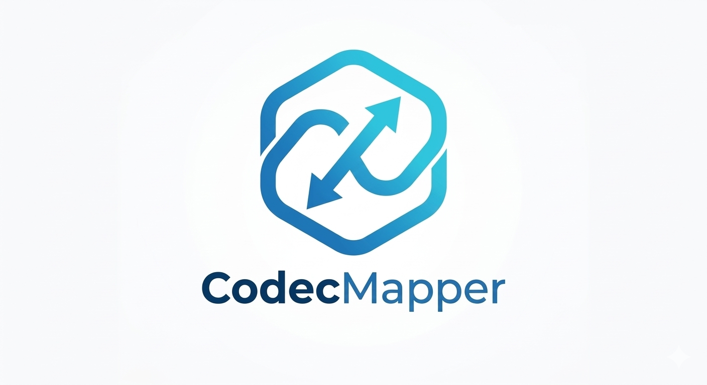

# CodecMapper

`CodecMapper` is a schema-first serialization library for F# focused on explicit contracts, symmetric encode/decode behavior, and portability across .NET AOT and Fable-oriented targets.

## Tutorials

Use tutorials when you are learning the library for the first time.

- [Getting Started](GETTING_STARTED.md)
  Learn the core schema DSL, how to read schema pipelines, and the compile-and-reuse workflow.

## How-To Guides

Use how-to guides when you already know what you want to accomplish.

- [How To Export JSON Schema](HOW_TO_EXPORT_JSON_SCHEMA.md)
  Generate JSON Schema documents or import external JSON Schema contracts.
- [How To Import Existing C# Contracts](HOW_TO_IMPORT_CSHARP_CONTRACTS.md)
  Bring `System.Text.Json`, `Newtonsoft.Json`, or `DataContract` models into `CodecMapper`.
- [Config Contracts Guide](CONFIG_CONTRACTS.md)
  Treat application configuration as an explicit versioned wire contract.

## Reference

Use reference docs when you need exact supported behavior or API lookup.

- [JSON Schema Support Reference](JSON_SCHEMA_SUPPORT.md)
  See the current supported export/import keyword surface and fallback boundaries.
- [API Reference](reference/index.html)
  Browse the public API surface generated from the inline docs.

## Explanations

Use explanations when you want the reasoning behind the design.

- [JSON Schema in CodecMapper](JSON_SCHEMA_EXPLANATION.md)
  Understand why structural parsing and fallback boundaries matter.
- [C# Attribute Bridge Design](CSHARP_ATTRIBUTE_BRIDGE.md)
  Understand why the bridge is conservative and `.NET`-only.

## Core Ideas

- Define one explicit schema and compile it into reusable codecs.
- Keep encode and decode semantics together, instead of scattering serializer settings across models.
- Treat wire contracts as versioned artifacts that can evolve deliberately.
- Prefer handwritten schema control over reflection-heavy runtime behavior.

## Current Surface

- Pipeline DSL for F# schema authoring
- JSON and XML codecs from the same schema
- Built-in support for common primitive, numeric, option, collection, and time-based types
- Raw JSON fallback via `Schema.jsonValue` for dynamic imported JSON shapes
- .NET-only bridge importers for `System.Text.Json`, `Newtonsoft.Json`, and `DataContract`

## Compatibility

- `CodecMapper` keeps the portable codec surface in the core [CodecMapper](reference/codecmapper.html) namespace and isolates the `.NET`-only import story in [CodecMapper.Bridge](reference/codecmapper-bridge.html).
- Native AOT and Fable compatibility share one runner in `tests/CodecMapper.CompatibilitySentinel/`, with thin shell apps in `tests/CodecMapper.AotTests/` and `tests/CodecMapper.FableTests/`.
- CI runs the Fable sentinel twice: once as a normal `.NET` executable and once through the Fable compiler as a transpilation smoke test.
